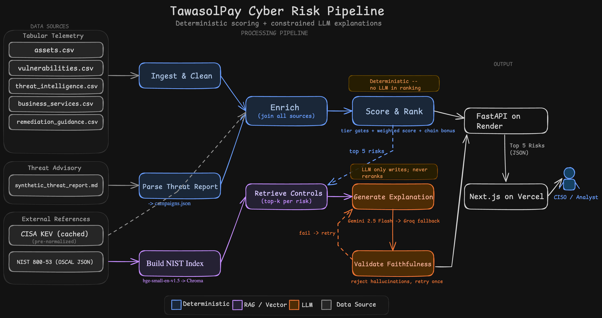
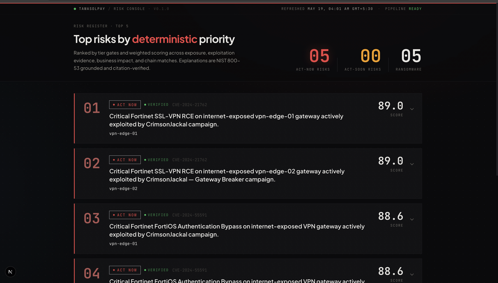

# TawasolPay Cyber Risk Assistant

> AI Engineering Intern Assessment for Hive Pro

Ranks the top 5 cyber risks for a fictional fintech (TawasolPay) by combining structured vulnerability data, asset context, threat intelligence, and semantic retrieval over NIST 800-53 controls. The ranking is fully deterministic. LLMs write explanations, not rankings.

**Live demo:** [Frontend](https://tawasolpay-risk-assistant.vercel.app/) · [API docs](https://tawasolpay-risk-assistant.onrender.com/docs) · [GitHub](https://github.com/MuaazSM/tawasolpay-risk-assistant)

---

## How it works

Five CSVs (assets, vulnerabilities, threat intelligence, business services, remediation guidance) and one MDR threat report feed into an enrichment layer that joins them against the CISA KEV catalog and parsed campaign data. A deterministic scoring engine assigns priority tiers (`act_now` / `act_soon` / `track` / `monitor`) via categorical gates, then applies a weighted 0 to 100 score with a chain bonus inside each tier. For each top-5 risk, a retrieval step pulls relevant NIST 800-53 controls from a Chroma vector index. Gemini 2.5 Flash (with Groq Llama 3.3 70B as a fallback) writes structured JSON explanations that can only cite evidence in the risk's packet. A faithfulness check enforces this, with a single retry if the LLM strays.



### Pipeline stages

```
CSV + MDR report
    -> ingest (type coercion, stale-asset flagging)
    -> enrichment (join assets, vulns, services, KEV, threat intel, campaigns, chains)
    -> scoring (tier gates, weighted score, sort)
    -> top-k selection
    -> NIST 800-53 retrieval (two-query RAG from Chroma)
    -> LLM explanation (Gemini, with Groq fallback, Pydantic-validated)
    -> faithfulness validation (reject hallucinated citations, retry once)
    -> API and frontend
```

---

## Sample output

Actual JSON returned by `GET /risks/top?k=5` (first risk, `retrieved_controls` truncated for brevity):

```json
{
  "rank": 1,
  "tier": "act_now",
  "asset_id": "A-1005",
  "vuln_id": "V-2015",
  "cve_id": "CVE-2024-21762",
  "asset_name": "vpn-edge-01",
  "score": 88.98,
  "score_breakdown": {
    "exposure": 15.0,
    "exploitation_evidence": 20.0,
    "ransomware": 15.0,
    "business_criticality": 15.0,
    "missing_controls": 3.33,
    "cvss": 4.9,
    "days_open": 0.75,
    "chain_bonus": 15.0,
    "total": 88.98
  },
  "explanation": {
    "headline": "Critical Fortinet SSL-VPN RCE on internet-exposed vpn-edge-01 gateway actively exploited by CrimsonJackal campaign.",
    "why_it_ranks_here": "CVE-2024-21762 carries a CVSS of 9.8 with weaponized exploit maturity and is listed in the CISA KEV catalog, confirming active exploitation in the wild. The CrimsonJackal, Gateway Breaker campaign specifically targets financial services and fintech firms, and this asset is internet-exposed with Critical business criticality. Chain amplification applies because a second CrimsonJackal CVE is present on the same asset.",
    "business_impact": "Compromise of vpn-edge-01 gives attackers a network entry point into the Remote Access service. The CrimsonJackal campaign deploys LockBit 3.0 ransomware post-exploitation, which could halt transaction processing and increase incident response obligations for an ISO 27001-scoped service.",
    "cited_cves": ["CVE-2024-21762", "CVE-2024-55591"],
    "cited_campaigns": ["CrimsonJackal, Gateway Breaker"],
    "cited_controls": ["SC-12.5", "SC-7.7", "SI-2"],
    "recommended_actions": [
      "Apply the vendor patch for CVE-2024-21762 immediately per SI-2 flaw remediation requirements.",
      "Implement split tunneling restrictions per SC-7.7 to prevent unauthorized external connections.",
      "Use PKI certificates or hardware tokens per SC-12.5 to harden VPN authentication."
    ]
  },
  "retrieved_controls": ["... 3 full NIST 800-53 controls with statement and discussion ..."],
  "ransomware_match": true,
  "faithfulness_violations": [],
  "faithfulness_passed": true
}
```

The assignment asks each risk to surface: asset, vulnerability, matched threat intel, business service at risk, and a plain-English explanation. In the response above: `asset_name` is the asset, `cve_id` and `explanation.headline` identify the vulnerability, `cited_campaigns` carries matched threat intel, `business_impact` names the business service, and the `explanation` object is the plain-English output.

Full top-5 ranking:

| Rank | Tier | Asset | CVE | Score | Headline |
|------|------|-------|-----|-------|----------|
| 1 | `act_now` | vpn-edge-01 | CVE-2024-21762 | 88.98 | Fortinet SSL-VPN RCE, CrimsonJackal chain |
| 2 | `act_now` | vpn-edge-02 | CVE-2024-21762 | 88.98 | Same RCE on second VPN edge in HA pair |
| 3 | `act_now` | vpn-edge-01 | CVE-2024-55591 | 88.62 | FortiOS auth bypass, second link in CrimsonJackal chain |
| 4 | `act_now` | vpn-edge-02 | CVE-2024-55591 | 88.62 | Same auth bypass on second VPN edge in HA pair |
| 5 | `act_now` | teamcity-prod | CVE-2024-27198 | 88.04 | TeamCity auth bypass, SilentForge Build Chain Theft |

The VPN edges dominate because they are internet-exposed, carry two chained CVEs from an active ransomware campaign, and underlie a Critical business service. This is the correct outcome. The scoring formula directly encodes the assignment's central rule: a 10/10 CVSS on an internal dev server should rank below an 8/10 on an internet-exposed payment gateway with active ransomware.

### Rendered output



The frontend renders the same JSON as an operations-style risk register. Each card expands to show the full explanation, cited evidence, NIST controls, and per-component score breakdown.

---

## The data split

**Vector store:** NIST 800-53 Rev 5 controls (around 1,100 controls from the OSCAL JSON). These are the only data that benefit from semantic retrieval. A risk description like "authentication bypass on VPN gateway" needs to find controls like IA-2 (Identification and Authentication) and AC-17 (Remote Access) by meaning, not keyword match. One chunk per control, embedded with `BAAI/bge-small-en-v1.5`.

**Structured records:** Everything else. The five CSVs are joined and filtered with pandas. They have clean foreign keys (`asset_id`, `cve_id`, `business_service`) that are best handled by exact-match joins, not approximate similarity. The MDR threat report is regex-parsed into `campaigns.json` with discrete fields (actor name, CVE list, target profile, IOCs). Its value is structural and precise; embedding it would lose specificity for no benefit.

---

## Design decisions

**Deterministic scoring, not LLM ranking.** The ranking is the most consequential output. A CISO asking "why is #1 above #2?" needs a score breakdown they can interrogate, not "the LLM thought so." The LLM has no signal beyond what the structured scorer already reads, so giving it the ranking job would add non-determinism without adding information.

**Tier gates plus weighted score.** Pure additive scoring lets many small factors bury a few large ones (five medium issues on a dev server outscore three severe ones on a payment gateway). Pure multiplicative scoring zeroes out non-exposed assets that still matter. Tier gates encode the categorical rules; the weighted score breaks ties within each tier.

**Chain amplification (+15).** When the same asset carries multiple CVEs matching the same active campaign, that's a validated multi-step attack path, not two unrelated findings. The +15 bonus promotes risks across tier boundaries when the asset is critical, and also contributes to within-tier ranking. Both effects are intentional.

**Three parallel sources of "actively exploited."** CISA KEV for real CVEs, threat intel for synthetic ones (`CVE-SYN-*`), and campaign matches from the parsed MDR report. Each is kept as a distinct boolean so the audit trail shows which source fired. The union drives scoring.

**Two-query NIST retrieval.** A single context-rich query pulls toward network and infrastructure controls and misses base controls like IA-2 (authentication) and SI-2 (patching) because the vocabulary of CVE descriptions doesn't overlap with NIST's regulatory prose. A second query using only NIST vocabulary catches the base controls. Results are interleaved so both queries contribute.

---

## What I considered and rejected

1. **LangChain or LangGraph.** The pipeline is linear with no agent decisions or tool-use loops. Plain Python is shorter and easier to debug.
2. **LLM council reranking.** Adds non-determinism and latency without bringing new signal. The deterministic scorer already sees everything a council would weigh.
3. **Embedding the threat report.** The report's value is in its structure (actor, CVE list, target sector). Parsing it preserves every field; embedding would return fuzzy matches when exact ones are available.

---

## Where it goes wrong

1. **Hand-tuned weights.** The scoring weights and tier thresholds were tuned to produce correct rankings on this dataset. They work here, but I have not backtested them against historical incident data, so I cannot promise they generalize to a different asset distribution.
2. **Brittle threat report parsing.** The regex parser assumes the MDR report follows a specific markdown structure. A report with restructured sections would silently produce an incomplete `campaigns.json`.
3. **Faithfulness check misses misattributions.** The validator catches hallucinated entities (a CVE or campaign not in the evidence). It does not catch wrong pairings, for example if the LLM attributed a CrimsonJackal CVE to SilentForge. Both names would individually pass the allowlist check.

When the faithfulness check does catch something, the retry path produces output like this (from a deliberately stress-tested run):

```
faithfulness FAIL -- risk A-1014/V-2043: cited control IA-7 not in
    retrieved set [IA-2, IA-5.11, SC-12.5]. Retrying with violations injected.
faithfulness PASS -- risk A-1014/V-2043: retry successful, violations=[]
```

In normal operation (temperature 0.1), all 5 risks pass on the first attempt. The retry path exists for when they don't.

---

## What I would do with more time

Backtest the scoring weights against historical incident data so they're empirically validated, not just intuitively tuned. The perturbation tests confirm that structural invariants survive weight changes, but the actual weight values are my best guesses from this dataset.

---

## Run it locally

### Prerequisites

- Python 3.11+
- Node.js 18+ (for frontend)
- API keys: [Gemini](https://aistudio.google.com/apikey) (primary) and/or [Groq](https://console.groq.com/keys) (fallback)

### Backend

```bash
git clone https://github.com/MuaazSM/tawasolpay-risk-assistant.git
cd tawasolpay-risk-assistant

python -m venv .venv && source .venv/bin/activate
pip install -e ".[dev]"

# Configure API keys
cp .env.example .env
# Edit .env with your GEMINI_API_KEY and/or GROQ_API_KEY

# Build reference data (one-time)
python scripts/fetch_kev.py            # Download CISA KEV catalog
python scripts/parse_threat_report.py  # Parse MDR report -> campaigns.json
python scripts/build_nist_index.py     # Build Chroma index (~1,100 NIST controls)
python scripts/export_onnx_model.py    # Export embedding model to ONNX

# Run the pipeline (CLI)
python -m src.pipeline --cache --json

# Start the API server
uvicorn api.main:app --reload --port 8000
```

### Frontend

```bash
cd frontend
npm install

# Point at local backend (Next.js uses .env.local for local dev)
echo "NEXT_PUBLIC_API_URL=http://localhost:8000" > .env.local

npm run dev   # -> http://localhost:3000
```

### Tests

```bash
pytest                                    # All tests
pytest tests/test_scoring_invariants.py   # Scoring perturbation tests
pytest tests/test_nist_retrieval.py       # RAG golden tests (needs Chroma index)
pytest --cov=src                          # With coverage
```

---

## API endpoints

| Method | Path | Description |
|--------|------|-------------|
| `GET` | `/health` | Pipeline readiness, risk count, last refresh timestamp |
| `GET` | `/risks/top?k=5` | Top-k ranked risks with explanations and NIST controls |
| `GET` | `/risk/{asset_id}/{vuln_id}` | Single risk detail |
| `POST` | `/refresh` | Re-run scoring, retrieval, and explanation on cached enriched data |
| `GET` | `/docs` | Auto-generated OpenAPI (Swagger UI) |